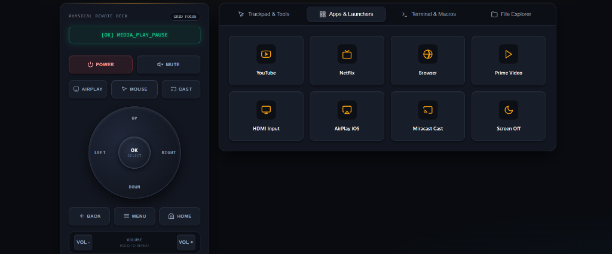

# Universal Web & Terminal Remote for Android TV & Projectors

[](LICENSE)
[]()
[]()
[]()

A high-performance, zero-install Web Remote and CLI Controller designed for **HY300**, **HY320**, **Magcubic**, and generic **Android TV / Google TV / Fire TV** devices.

If your physical projector remote is lost, broken, or unresponsive, this tool restores complete control over local Wi-Fi using standard Android Debug Bridge (ADB). No Android rooting, no custom APK sideloading, and no external cloud services are required.

<p align="center">
  
</p>

---

## Key Features

- **Standalone Single-File Web UI (`index.html`)**: Self-contained HTML5 interface with embedded CSS and JavaScript. Zero bundlers, zero npm dependencies, and zero build steps.
- **Mobile & Desktop Optimized**: Responsive virtual remote for smartphones and full command control panel for desktop workstations.
- **Directional Navigation**: D-Pad (Up, Down, Left, Right, OK, Back, Home, Menu, Settings).
- **Virtual Touchpad & Hardware Cursor**: Smooth mouse motion, tap-to-click, wheel scrolling, and hardware cursor toggle for projector pointer modes.
- **Audio & Power Controls**: Volume up, volume down, mute toggle, and power/standby switches.
- **Instant Keyboard Text Injection**: Stream text strings directly into Android search bars and login inputs without on-screen keyboard typing fatigue.
- **App Shortcuts**: 1-click launchers for YouTube, Netflix, Prime Video, Browser, HDMI Source Switcher, Settings, and Cast/Miracast.
- **Linux & macOS Terminal Remote (`remote.sh`)**: Interactive raw-terminal controller for environments without Python or web browsers.
- **Subnet Auto-Discovery**: Automatic network scan across local IPv4 subnets to detect active ADB devices on port 5555.
- **Remote File Manager & Storage Inspector**: Browse partitions, monitor disk usage, install APKs, and transfer files.

---

## Device Compatibility

| Device Category | Supported Models / Platforms | Connection Method |
| :--- | :--- | :--- |
| **Smart Projectors** | HY300, HY300 Pro, HY320, Magcubic, Salange, Allwinner H713 | Wi-Fi (ADB Port 5555) / USB |
| **Android TV / Google TV** | Xiaomi Mi Box/Stick, Chromecast with Google TV, Mecool, Nvidia Shield | Wi-Fi (ADB Port 5555) |
| **Amazon Fire TV** | Fire TV Stick, Fire TV Cube, Fire TV Edition | Network ADB (Port 5555) |
| **Generic Android Boxes** | Rockchip (RK3328/RK3566), Amlogic (S905X), Allwinner | Wi-Fi / Ethernet / USB |

---

## Prerequisites: Android SDK Platform-Tools

To keep this repository clean and avoid shipping untrusted binary blobs, Google's official `adb` binary is not bundled in git. Download the official platform-tools package for your operating system:

### Official Google CDN Download Links
- **Windows**: [Download Platform-Tools for Windows](https://dl.google.com/android/repository/platform-tools-latest-windows.zip)
- **Linux**: [Download Platform-Tools for Linux](https://dl.google.com/android/repository/platform-tools-latest-linux.zip)
- **macOS**: [Download Platform-Tools for macOS](https://dl.google.com/android/repository/platform-tools-latest-darwin.zip)

### Package Manager Installation (Recommended)
- **Debian / Ubuntu / Raspberry Pi**:
  ```bash
  sudo apt update && sudo apt install adb
  ```
- **macOS (Homebrew)**:
  ```bash
  brew install android-platform-tools
  ```
- **Windows (winget)**:
  ```cmd
  winget install Google.PlatformTools
  ```
- **Arch Linux**:
  ```bash
  sudo pacman -S android-tools
  ```

---

## Quick Start Guide

### Option A: Web Control Panel (Windows, Linux, macOS with Python)

1. Clone or download this repository:
   ```bash
   git clone https://github.com/YOUR_USERNAME/universal-android-tv-remote.git
   cd universal-android-tv-remote
   ```
2. Place `adb.exe` (or `adb` on Linux/macOS) in the folder, or ensure `adb` is in your system PATH.
3. Start the server:
   - **Windows**: Double-click `remote.bat` or run:
     ```cmd
     python projector.py --ip 192.168.100.5
     ```
   - **Linux / macOS**:
     ```bash
     python3 projector.py --ip 192.168.100.5
     ```
4. The web control panel opens automatically at `http://127.0.0.1:7070`.

---

### Option B: Terminal Remote (`remote.sh` for Linux, macOS & BSD)

For lightweight environments without Python:
1. Make the script executable:
   ```bash
   chmod +x remote.sh
   ```
2. Run with your device IP:
   ```bash
   ./remote.sh 192.168.100.5
   ```
3. Control navigation directly using keyboard keys:
   - **Arrows / WASD**: D-Pad navigation
   - **Enter / Space**: OK / Select
   - **Esc / Backspace**: Back
   - **H**: Home
   - **M**: Menu
   - **O**: Settings
   - **+ / -**: Volume Up / Down
   - **X**: Mute
   - **P**: Power Toggle
   - **T**: Send text prompt
   - **Q**: Quit

---

## Enabling ADB on Your Projector / Android TV

Before connecting over the network, enable Developer Options and Network Debugging:

1. On your projector or TV, navigate to **Settings > About Device**.
2. Locate **Build Number** and click it **7 times** until a prompt confirms "You are now a developer".
3. Return to **Settings > Developer Options** (or **Preferences**).
4. Enable **USB Debugging**.
5. Enable **Network Debugging** / **Wireless Debugging** (if present as a separate toggle).
6. Find your projector's local IP under **Settings > Network & Internet > Connected Wi-Fi > Status Information**.
7. If your device displays a prompt stating **"Allow USB Debugging from this computer?"**, check **"Always allow from this computer"** and select **OK**.

---

## Project Structure

```
├── index.html              # Standalone web remote (inline CSS/JS, 0 dependencies)
├── projector.py            # Lean Python HTTP server & ADB controller
├── remote.sh               # POSIX/Bash interactive terminal remote
├── remote.bat              # Windows environment validator and launcher
├── .gitignore              # Ignores platform-tools binaries and temporary logs
├── LICENSE                 # MIT License
├── README.md               # User guide and SEO reference
└── documentation.md        # Technical architecture and API contract
```

---

## REST API Reference

The local server exposes standard JSON endpoints:

- `POST /cmd`: Dispatch key action (e.g. `{"key": "up"}`)
- `POST /mouse`: Dispatch touch/mouse coordinate event
- `POST /mouse_rel`: Dispatch cursor delta (`{"dx": 10, "dy": 0}`)
- `POST /text`: Stream text input (`{"text": "Search Title"}`)
- `POST /app`: Launch app package (`{"app": "youtube"}`)
- `POST /connect`: Connect to target IP (`{"ip": "192.168.1.100"}`)
- `GET /status`: Query connection status and active input nodes

---

## License

This project is licensed under the [MIT License](LICENSE). You are free to use, modify, distribute, and integrate it into your personal or commercial setups.
